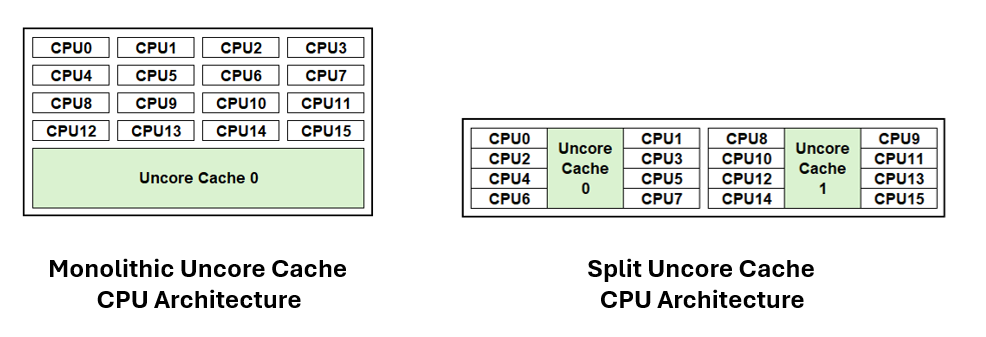
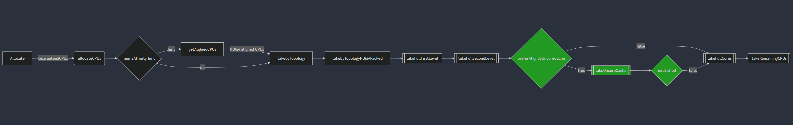
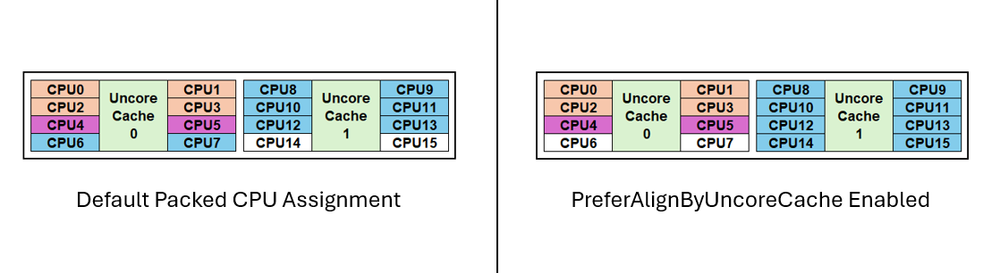
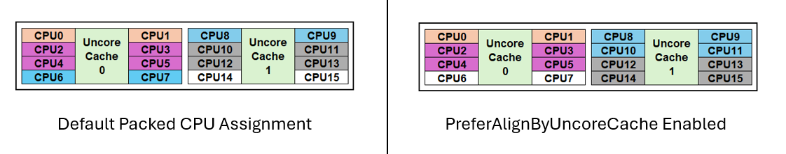

# KEP-4800: Split UncoreCache Toplogy Awareness in CPU Manager

<!-- toc -->
- [Release Signoff Checklist](#release-signoff-checklist)
- [Summary](#summary)
- [Motivation](#motivation)
  - [Goals](#goals)
  - [Non-Goals](#non-goals)
- [Proposal](#proposal)
  - [User Stories (Optional)](#user-stories-optional)
    - [Story 1](#story-1)
    - [Story 2](#story-2)
  - [Notes/Constraints/Caveats (Optional)](#notesconstraintscaveats-optional)
  - [Risks and Mitigations](#risks-and-mitigations)
- [Design Details](#design-details)
  - [Test Plan](#test-plan)
      - [Prerequisite testing updates](#prerequisite-testing-updates)
      - [Unit tests](#unit-tests)
      - [Integration tests](#integration-tests)
      - [e2e tests](#e2e-tests)
  - [Graduation Criteria](#graduation-criteria)
    - [Alpha](#alpha)
  - [Upgrade / Downgrade Strategy](#upgrade--downgrade-strategy)
  - [Version Skew Strategy](#version-skew-strategy)
- [Production Readiness Review Questionnaire](#production-readiness-review-questionnaire)
  - [Feature Enablement and Rollback](#feature-enablement-and-rollback)
  - [Rollout, Upgrade and Rollback Planning](#rollout-upgrade-and-rollback-planning)
  - [Monitoring Requirements](#monitoring-requirements)
  - [Dependencies](#dependencies)
  - [Scalability](#scalability)
  - [Troubleshooting](#troubleshooting)
- [Implementation History](#implementation-history)
- [Drawbacks](#drawbacks)
- [Alternatives](#alternatives)
- [Infrastructure Needed (Optional)](#infrastructure-needed-optional)
<!-- /toc -->

## Release Signoff Checklist

Items marked with (R) are required *prior to targeting to a milestone / release*.

- [x] (R) Enhancement issue in release milestone, which links to KEP dir in [kubernetes/enhancements] (not the initial KEP PR)
- [x] (R) KEP approvers have approved the KEP status as `implementable`
- [x] (R) Design details are appropriately documented
- [ ] (R) Test plan is in place, giving consideration to SIG Architecture and SIG Testing input (including test refactors)
  - [ ] e2e Tests for all Beta API Operations (endpoints)
  - [ ] (R) Ensure GA e2e tests meet requirements for [Conformance Tests](https://github.com/kubernetes/community/blob/master/contributors/devel/sig-architecture/conformance-tests.md) 
  - [ ] (R) Minimum Two Week Window for GA e2e tests to prove flake free
- [ ] (R) Graduation criteria is in place
  - [x] (R) [all GA Endpoints](https://github.com/kubernetes/community/pull/1806) must be hit by [Conformance Tests](https://github.com/kubernetes/community/blob/master/contributors/devel/sig-architecture/conformance-tests.md) 
- [x] (R) Production readiness review completed
- [ ] (R) Production readiness review approved
- [x] "Implementation History" section is up-to-date for milestone
- [ ] User-facing documentation has been created in [kubernetes/website], for publication to [kubernetes.io]
- [x] Supporting documentation—e.g., additional design documents, links to mailing list discussions/SIG meetings, relevant PRs/issues, release notes

[kubernetes.io]: https://kubernetes.io/
[kubernetes/enhancements]: https://git.k8s.io/enhancements
[kubernetes/kubernetes]: https://git.k8s.io/kubernetes
[kubernetes/website]: https://git.k8s.io/website

## Summary

This KEP proposes to introduce a new CPU Manager static policy option, "prefer-align-cpus-by-uncorecache", that groups CPU resources by uncore cache where possible.
The opt-in feature changes the cpu assignment algorithm to add sorting by uncore cache and then taking cpus aligned to the same uncore cache, where possible.
In cases where numbers of cpu requested exceeds number of cpus grouped in the same uncore cache, the algorithm attempts best-effort to reduce assignments of cpus across minimal numbers of uncore caches.
If the cpumanager cannot align optimally, it will still admit the workload as before. Uncore cache assignment will be preferred but not a requirement for this feature.
This feature does not introduce the requirement of aligned by uncorecache but the preference to alignment of uncorecache.

## Motivation

Traditional CPU architectures commonoly employ a monolithic uncore cache design where all CPU cores share equal access to a unified uncore cache. To address scalability challenges, CPU architectures are adopting a modular design. One such example is the split uncore cache architecture, where subsets of CPU cores are grouped with dedicated uncore caches, and these modular units are interconnected to form the complete processor.

The primary goal of this proposal is to integrate the split uncore cache architecture into the static CPU Manager and enhance container resource allocation by mitigating noisy neighbor issues and intercross-cache latency. This optimization is particularly relevant for systems featuring a split uncore cache, which is supported on both x86 and ARM architectures.
The challenge with current kubelet’s cpu manager is that it is unaware of split uncore architecture and can distribute CPU assignments across multiple uncore caches. This creates a noisy neighbor problem where multiple pods/containers are sharing the same uncore cache. In addition, containers spread across multiple uncore caches can see higher latency and reduced performance due to inter-cache access latency. For workload use cases that are sensitive to cache latency and are performance deterministic, minimizing the uncore cache spread can have significant improvements in performance.

The figure below highlights performance gain when pod placement is aligned to an uncore cache group. In this example HammerDB TPROC-C/My-SQL is the workload deployed. There was a 18% uplift in performance when uncore cache aligned compared to default behavior. Other workloads may see higher or lower gains based on uncore cache utilization.

 

### Goals

- Introduce a new CPU Manager policy option that attempts to assign CPUs within the same uncore cache group to a container.  
- Minimize the number of CPUs assignments from different uncore cache grouping to containers.

### Non-Goals

- This proposal does not aim to modify CPU assignments for CPU Manager policy set to none.
- This does not alter the behavior of existing static policy options such as full-pcpus-only.

## Proposal

- Add a new static policy option to fine-tune CPU assignments to have a preference to align by uncore cache grouping.

- Topology struct already contains CPUDetails which is a map of CPUInfo.  CPUInfo knows about NUMA, socket, and core IDs associated with a CPU.  We need to add a new member called `uncorecacheId` into the CPUInfo struct that tracks whether the CPU is part of a split uncore cache. Functionality to support this was merged in cadvisor with these pull-requests [cadvisor/pr-2849](https://github.com/google/cadvisor/pull/2849) and [cadvisor/pr-2847](https://github.com/google/cadvisor/pull/2847/)

- Handle enablement of the policy option in pkg/kubelet/cm/cpumanager/policy_options.go and check the validity of the user flag and capability of the system.  If topology does not support split uncore caches, grouping by uncore cache static policy will be ignored.  

- Modify the "Allocate" static policy to check for the option, `prefer-align-cpus-by-uncorecache`. For platforms where SMT is enabled, `prefer-align-cpus-by-uncorecache` will continue to follow default behaviour and try to allocate full cores when possible. `prefer-align-cpus-by-uncorecache` can be enabled along with `full-pcpus-only` and enforce full core assignment with uncorecache alignment.

- `prefer-align-cpus-by-uncorecache` will be compatible with the default CPU allocation logic.

### User Stories (Optional)

#### Story 1

- As a HPC user, I want to extract the best performance possible and reduce latency, so that I can extract the most value when deploying applications in Kubernetes. I can use the static CPU Manager Policy option, but on split uncore cache processors, my application can experience latency when assigned CPUs across multiple uncore caches. In order to maximize performance, I want to minimize the distribution across uncore caches to minimize the latency. I want a feature I can enable so the CPU allocation logic inside the kubelet will automatically handle this for me for larger clusters for simple deployment and efficiency.

#### Story 2

- As a Networking/Telco Engineer, my application is latency sensitive, to which uncore cache misalignment is a contributing factor. I want my application to be statically assigned to CPUs that correspond to one single uncore cache so that I can get the maximum throughput from my application. Additionally, I have applications that are also static and of different CPU size requirements. The default Static CPU Manager Policy will result in my applications being assigned to two or more uncore caches. I have a large multi-node Kuberentes cluster. I want a cpu allocation logic to automatically assign CPUs for the best performance across the fewest amount of uncore cahces based on available CPUs without having to worry about what order/size I deploy my applications so I can ensure I get the best performance possible. 

### Notes/Constraints/Caveats (Optional)

- The name UncoreCache is directly derived from cAdvisor that is being used as a package. 
- Using the flow in `CPUManagerPolicy{Alpha,Beta}Options` from [xref](https://github.com/kubernetes/kubernetes/blob/af879aebb1a866a2f0e45bb33c09a1cc8f7acc45/pkg/features/kube_features.go#L110C1-L117C83) which is used to avoid proliferation of feature gates. 

### Risks and Mitigations

- Risk: Enabling or disabling the feature might lead to unexpected behavior
  - Mitigation: Feature is enabled by a static policy option flag
- Risk: The new feature might interfere with existing functionality
  - Mitigation: It does not change behavior of non-static policy and preserves the behavior of other static options
- Risk: Inconsistent configuration could cause scheduling issues
  - Mitigation: Failure will occur during runtime if mismatch between options occurs, preventing the Pod from being scheduled incorrectly or leading a non-optimal aligment

## Design Details

We propose to:

- make the CPUManager aware of the Uncore Cache architecture.
- add a new static CPUManager option called `prefer-align-cpus-by-uncorecache` that affines CPU resources to a container while minimizing the UncoreCache distribution at a best effort policy. 

To make Kubelet be uncore cache aware for CPU sensitive workloads, the CPU allocation, `UncoreCacheID` has been added to the `CPUInfo` and `CPUTopology` structures that are provided by `cAdvisorapi.MachineInfo` during the CPU discovery process.

A new static CPUManager policy option, prefer-align-cpus-by-uncorecache, will be introduced to enable the proposed feature. When enabled, the algorithm for `prefer-align-cpus-by-uncorecache` will be implemented to follow the default packed behavior of the existing static CPUManager allocation with the introduction of a uncorecache hierarchy. Below is a high level view of how the proposed implementation will be integrated.

- Each guaranteed and static container of the pod is allocated resources starting with the `Allocate` method where the CPU resource need is determined to meet the `full-pcpus-only` criteria (if enabled) and indentify any `numaAffinity` hints for the pod/container. 
- The CPU resource requirements and NUMA hints are then passed to the `allocateCPUs` method where the node's allocatable CPU resources are determined. If a NUMA hint exists, the allocatable CPU resource pool is refined to the respective NUMA that is indicated from the hint provider. 
- The allocatable CPU pool and CPU resource requirement are then passed to `takeByTopology` where a NUMAPacked method or a NUMADistributed method is determined. This feature will only be compatible with the NUMAPacked method and not compatible with NUMADistributed. Distributing CPU allocations evenly across NUMAs for containers requiring more resources than a single NUMA can undermine the objective of minimizing CPU distributions across uncore caches. Workloads that are sensitive to uncore cache latency and benefit from this feature may experience increased latency due to the added cross-NUMA latency among the uncore caches.
- The CPU topology, allocatable CPU pool, and required CPUs for the container are then passed to the `takeByTopologyNUMAPacked` method. This method begins to schedule CPU resources according to the CPU topology hierarchy. We will add the Static Policy Options as a variable for this method to determine the `preferAlignCPUsByUncoreCache` boolean and `cpuSortingStrategy` boolean to be used in the allocation logic below. Passing all Static Policy options reduces the amount of variables for the method and allows for future extensions to the UncoreCache alignment policy.
  1. If the number of CPUs required for the container is equal to or larger than a total NUMA/Socket's-worth of CPUs (depending on which is larger in the hierarchy), allocate whole NUMA/sockets (`takeFullFirstLevel`).
  2. If the remaining CPUs required or original requirement of CPUs for the container is equal to or larger than a total NUMA/Socket's worth of CPUs (depending on which is smaller in the hierarchy), allocate whole NUMA/sockets (`takeFullSecondLevel`).
  3. **Added feature**: If `preferAlignCPUsByUncoreCache` is enabled, use the `takeUncoreCache` method. Scan through every uncore cache index in numerical order:
      - If the required CPUs are greater than or equal the size of the **total** amount of CPUs to an uncore cache, assign the full uncore cache CPUs if they are all **unscheduled** within the group. Subtract the amount of scheduled CPUs from the quantity of required CPUs. This submethod will be called `takeFullUncore`.
       - Continue scanning uncore caches in numerical order and assigning full uncore cache CPU groups until the required quantity is less than the **total** number of CPUs to a uncore cache group (`takeFullUncore`).
      - If the required CPUs are less than the size of the **total** amount of CPUs to an uncore cache, scan through the remaining uncore cache index and assign CPUs if there are enough **available** CPUs within the uncore cache group. This submethod will be called `takePartialUncore`.    
  4. If the required amount of CPUs cannot fit within an uncore cache group and there are enough schedulable cores on the node, assign cores in numerical order as available (`takeFullCores`).
  5. If the CPU requirement is still not satisfied and there are enough CPUs available, assign CPUs in numerical order as available (`takeRemainingCPUs`).

In the case where the NUMA boundary is larger than a socket (setting NPS0 on a dual-socket system), the full node will be scheduled to the container if it requires the total NUMA amount of CPUs. Otherwise, if the CPU requirement for the container is less than the total CPUs to the NUMA, the logic will begin with (`takeFullSecondLevel`). The node can not be over committed. 

In the case where the NUMA boundary is smaller than an uncore cache (enabling Sub-NUMA clustering on a monolithic cache system), the logic will being with `takeFullSecondLevel` (assuming the CPU requirement is less than the total number of CPUs to the socket). A NUMA's worth of CPUs will be assigned until the required CPUs are less than the total number of CPUs to a NUMA. The logic will then skip `takeFullUncore` since it will be equivalent to a Socket's worth of CPUs. `takePartialUncore` will then assign CPUs if there are enough CPUs to satisfy the requirements.

The following are examples of the implementation of `takeUncoreCache`. For the example below, a 16-core split uncore cache processor is scheduling the following Guaranteed containers using the static policy with preferAlignCPUsByUncoreCache` enabled and disabled.
- Reserved CPUs: 0-3
- Allocatable CPUs: 4-15
- Container 1: 2 CPUs
- Container 2: 8 CPUs

The following shows the two different CPU assignment outcomes for the default static policy allocation and the `prefer-align-cpus-by-uncorecache` option. Assuming both containers are running uncore cache sensitive workloads, Container 1 and Container 2 will suffer from the noisy neighbor effect due to both workloads competing to access Uncore Cache 0. Container 2 will suffer from cross-cache latency as CPUs 6&7 need to access Uncore Cache 1 and CPUs 8-15 need to access Uncore Cache 0.

Uncore Cache sensitive applications can be deployed on the edge where lower core count and more efficient systems are utilized. These applications often requires CPUs less than the total CPUs of an Uncore Cache group. Newer split architecture processors have increased uncore cache size and bandwidth which has helped reduced the noisy neighbor problem. However, the workloads can still be sensitive to cross cache latency. The example below helps illustrate why `takePartialUncore` is important to fully maximize nodes that have less uncore caches available. or the example below, a 16-core split uncore cache processor is scheduling the following Guaranteed containers using the static policy with preferAlignCPUsByUncoreCache` enabled and disabled.
- Reserved CPUs: 0-1
- Allocatable CPUs: 2-15
- Container 1: 4 CPUs
- Container 2: 4 CPUs
- Container 3: 4 CPUs

In the depiction above, Container 2 will suffer from cross cache latency using the default packed CPU allocation despite having enough room to fit on Uncore Cache 1. With `preferAlignCPUsByUncoreCache`, the available CPUs on the node can be maximized and run as optimally as possible using the takePartialUncore` method.

This scheduling policy will minimize the distribution of containers across uncore caches to improve performance while still maintaining the default packed logic. The scope will be initially be narrowed to implement uncore cache alignment to the default static scheduling behavior. The table below summarizes future enhancement plans to implement uncore cache alignment to be compatible with the distributed scheduling policies to reduce contention/noisy neighbor effects.

| Compatibility | alpha | beta | GA |
| --- | --- | --- | --- |
| full-pcpus-only | x | x | x |
| distribute-cpus-across-numa  |   |   |   |
| align-by-socket |   | x | x |
| distribute-cpus-across-cores |   | x | x |

Since this feature is a best-effort policy and will not evict containers that are unable to be restricted to CPUs that belong to a single uncore cache, a metric will need to be provided to let the user identify if the container is uncore cache aligned as well.

### Test Plan

<!--
**Note:** *Not required until targeted at a release.*
The goal is to ensure that we don't accept enhancements with inadequate testing.

All code is expected to have adequate tests (eventually with coverage
expectations). Please adhere to the [Kubernetes testing guidelines][testing-guidelines]
when drafting this test plan.

[testing-guidelines]: https://git.k8s.io/community/contributors/devel/sig-testing/testing.md
-->

[x] I/we understand the owners of the involved components may require updates to
existing tests to make this code solid enough prior to committing the changes necessary
to implement this enhancement.

##### Prerequisite testing updates

<!--
Based on reviewers feedback describe what additional tests need to be added prior
implementing this enhancement to ensure the enhancements have also solid foundations.
-->

##### Unit tests

We plan on adding/modifying functions to the following files to create the uncorecache alignment feature:
- pkg/kubelet/cm/cpumanager/cpu_assignment.go
- /pkg/kubelet/cm/cpumanager/cpu_manager.go
- /pkg/kubelet/cm/cpumanager/policy_options.go
- /pkg/kubelet/cm/cpumanager/topology/topology.go

Existing topoology test cases will be modified to include uncorecache topology. All modified and added functions will have new test cases.

<!--
In principle every added code should have complete unit test coverage, so providing
the exact set of tests will not bring additional value.
However, if complete unit test coverage is not possible, explain the reason of it
together with explanation why this is acceptable.
-->

<!--
Additionally, for Alpha try to enumerate the core package you will be touching
to implement this enhancement and provide the current unit coverage for those
in the form of:
- <package>: <date> - <current test coverage>
The data can be easily read from:
https://testgrid.k8s.io/sig-testing-canaries#ci-kubernetes-coverage-unit

This can inform certain test coverage improvements that we want to do before
extending the production code to implement this enhancement.
-->
- `/pkg/kubelet/cm/cpumanager/cpu_assignment.go`: `2024-08-26` - `93.5%`
- `/pkg/kubelet/cm/cpumanager/cpu_manager.go`: `2024-08-26` - `74.5%`
- `/pkg/kubelet/cm/cpumanager/policy_static.go`: `2024-08-26` - `89.5%`
- `/pkg/kubelet/cm/cpumanager/topology/topology.go`: `2024-9-30` - `93.2%`

Unit tests will be created to test the proposed feature's functionality starting from the static policy's `Allocate` method. The unit tests will show that containers are assigned CPUs from an individual uncore cache.

The `prefer-align-cpus-by-uncorecache` feature will be enabled and tested individually. The following features will also be enabled alongside to test the proposed feature's compatibility with existing static CPU Manager policies:
- `full-pcpus-only`
- Topology Manager NUMA Affinity

The following CPU Topologies are representative of various uncore cache architectures and will be added to policy_test.go and represented in the unit testing. 

- 1P AMD EPYC 7702P 64C (smt-on/off) NPS=1, 16 uncore cache instances/socket
- 2P AMD EPYC 7303 32C (smt-on/off) NPS=1, 4 uncore cache instances/socket
- 1P AMD EPYC 9754 128C (smt-on) NPS=1, 16 uncore cache instances/socket   
- 2P AMD EPYC 9654 96C (smt-off) NPS=2, 12 uncore cache instances/socket   
- 2P Intel Xeon Platinum 8490H 60c  (hyperthreading off)
- 2P Intel Xeon Platinum 8490H 60c (hyperthreading on) with Sub-NUMA Clustering
- 1P Intel Core i7-12850HX
- 1P ARM Ampere Altra 128c, 16 uncore cache instances/socket
- AWS Graviton

##### Integration tests

N/A. This feature requires a e2e test for testing.

##### e2e tests

- For e2e testing, checks will be added to determine if the node has a split uncore cache topology. If node does not meet the requirement to have multiple uncore caches, the added tests will be skipped. 
- e2e testing should cover the deployment of a pod that is following uncore cache alignment. CPU assignment can be determined by podresources API and programatically cross-referenced to syfs topology information to determine proper uncore cache alignment.
- For e2e testing, guaranteed pods will be deployed with various CPU size requirements on our own baremetal instances across different vendor architectures and confirming the CPU assignments to uncore cache core groupings. This feature is intended for baremetal only and not cloud instances.
- Update CI to test GCP instances of different architectures utilizing uncore cache alignment feature.

### Graduation Criteria

#### Alpha

- Feature implemented behind a feature gate flag option
- E2E Tests will be skipped until nodes with uncore cache can be provisioned within CI hardware. Work is ongoing to add required systems (https://github.com/kubernetes/k8s.io/issues/7339). E2E testing will be required to graduate to beta.

### Upgrade / Downgrade Strategy

N/A

### Version Skew Strategy

N/A

## Production Readiness Review Questionnaire

<!--

Production readiness reviews are intended to ensure that features merging into
Kubernetes are observable, scalable and supportable; can be safely operated in
production environments, and can be disabled or rolled back in the event they
cause increased failures in production. See more in the PRR KEP at
https://git.k8s.io/enhancements/keps/sig-architecture/1194-prod-readiness.

The production readiness review questionnaire must be completed and approved
for the KEP to move to `implementable` status and be included in the release.

In some cases, the questions below should also have answers in `kep.yaml`. This
is to enable automation to verify the presence of the review, and to reduce review
burden and latency.

The KEP must have a approver from the
[`prod-readiness-approvers`](http://git.k8s.io/enhancements/OWNERS_ALIASES)
team. Please reach out on the
[#prod-readiness](https://kubernetes.slack.com/archives/CPNHUMN74) channel if
you need any help or guidance.
-->

### Feature Enablement and Rollback

To enable this feature requires enabling the feature gates for static policy in the Kubelet configuration file for the CPUManager feature gate and add the policy option for uncore cache alignment

###### How can this feature be enabled / disabled in a live cluster?

For `CPUManager` it is a requirement going from `none` to `static` policy cannot be done dynamically because of the `cpu_manager_state file`. The node needs to be drained and the policy checkpoint file (`cpu_manager_state`) need to be removed before restarting Kubelet. This feature specifically relies on the `static` policy being enabled.

- [x] Feature gate (also fill in values in `kep.yaml`)
  - Feature gate name: `CPUManagerAlphaPolicyOptions`
  - Components depending on the feature gate: `kubelet`
- [x] Other
  - Describe the mechanism: Change the `kubelet` configuration to set a `CPUManager` policy of static then setting the policy option of `prefer-align-cpus-by-uncorecache`
  - Will enabling / disabling the feature require downtime of the control
    plane? No.
  - Will enabling / disabling the feature require downtime or reprovisioning
    of a node? Yes, a `kubelet` restart is required for changes to take place.

###### Does enabling the feature change any default behavior?

No, to enable this feature, it must be explicitly set in the `CPUManager` static policy and the policy option `prefer-align-cpus-by-uncorecache` must be set.

###### Can the feature be disabled once it has been enabled (i.e. can we roll back the enablement)?

Yes this feature can be disabled it will just require a restart of `kubelet`. The Kubelet configuration will need to be set with the static policy option and prefer-align-cpus-by-uncorecache flag removed.

###### What happens if we reenable the feature if it was previously rolled back?

Feature will be enabled. Proper drain of node and restart of kubelet required. Feature is not intended to be enabled/disabled dynamically, similar to static policy.

###### Are there any tests for feature enablement/disablement?

Option is not enabled dynamically. To enable/disable option, cpu_manager_state must be removed and kubelet must be restarted.
Unit tests will be implemented to test if the feature is enabled/disabled.
E2e node serial suite can be use to test the enablement/disablement of the feature since it allows the kubelet to be restarted.

### Rollout, Upgrade and Rollback Planning

<!--
This section must be completed when targeting beta to a release.
-->

###### How can a rollout or rollback fail? Can it impact already running workloads?

Kubelet restarts are not expected to impact existing CPU assignments to already running workloads

###### What specific metrics should inform a rollback?

Increased pod startup time/latency 

###### Were upgrade and rollback tested? Was the upgrade->downgrade->upgrade path tested?

N/A, because way to upgrade and rollback would be the same process of removing the CPU Manager state file and drain the node of pods then restarting kubelet.  

###### Is the rollout accompanied by any deprecations and/or removals of features, APIs, fields of API types, flags, etc.?

No

### Monitoring Requirements

Reference CPUID info in podresources API to be able to verify assignment.

###### How can an operator determine if the feature is in use by workloads?

Reference podresources API to determine CPU assignment and CacheID assignment per container.
Use proposed 'container_aligned_compute_resources_count' metric which reports the count of containers getting aligned compute resources. See PR#127155 (https://github.com/kubernetes/kubernetes/pull/127155).

###### How can someone using this feature know that it is working for their instance?

Reference podresources API to determine CPU assignment.

- [x] Other
  - Metric: container_aligned_compute_resource_count
  - Other field: CPUID from podresources API

###### What are the reasonable SLOs (Service Level Objectives) for the enhancement?

Measure the time to deploy pods under default settings and compare to the time to deploy pods with align-by-uncorecache enabled. Time difference should be negligible.

###### What are the SLIs (Service Level Indicators) an operator can use to determine the health of the service?

- Metrics
  - `topology_manager_admission_duration_ms`: Which measures the the duration of the admission process performed by Topology Manager.

###### Are there any missing metrics that would be useful to have to improve observability of this feature?

Utilized proposed 'container_aligned_compute_resources_count' in PR#127155 to be extended for uncore cache alignment count.

<!--
Describe the metrics themselves and the reasons why they weren't added (e.g., cost,
implementation difficulties, etc.).
-->

### Dependencies

<!--
This section must be completed when targeting beta to a release.
-->

###### Does this feature depend on any specific services running in the cluster?

No

### Scalability

<!--
For alpha, this section is encouraged: reviewers should consider these questions
and attempt to answer them.

For beta, this section is required: reviewers must answer these questions.

For GA, this section is required: approvers should be able to confirm the
previous answers based on experience in the field.
-->

###### Will enabling / using this feature result in any new API calls?

All of the housekeeping for this feature is node internal, and thus will not require the kubelet request anything new of the apiserver

###### Will enabling / using this feature result in introducing new API types?

No

###### Will enabling / using this feature result in any new calls to the cloud provider?

NA. 

###### Will enabling / using this feature result in increasing size or count of the existing API objects?

No

###### Will enabling / using this feature result in increasing time taken by any operations covered by existing SLIs/SLOs?

Pod startup time can directly affected because CPUManager will have to do a few extra steps when scheduling a Pod. This extra steps would be negligible as all the computation is done on RAM.

###### Will enabling / using this feature result in non-negligible increase of resource usage (CPU, RAM, disk, IO, ...) in any components?

No

###### Can enabling / using this feature result in resource exhaustion of some node resources (PIDs, sockets, inodes, etc.)?

No

### Troubleshooting

<!--
This section must be completed when targeting beta to a release.

For GA, this section is required: approvers should be able to confirm the
previous answers based on experience in the field.

The Troubleshooting section currently serves the `Playbook` role. We may consider
splitting it into a dedicated `Playbook` document (potentially with some monitoring
details). For now, we leave it here.
-->

###### How does this feature react if the API server and/or etcd is unavailable?

There is no known consequence since this component is dedicated for CPU allocation for Pods which does not directly interact with any API server.

###### What are other known failure modes?

- Feature is best effort, resulting in potential for non-optimal uncore cache alignment when node is highly utilized.
  - Detection: Reference proposed metric in podresource API
  - Mitigation: Feature is preferred/best-effort
  - Diagnostics: Reference podresource API
  - Testing for failure mode not required as alignment is preferred and not a requirement
    
<!--
For each of them, fill in the following information by copying the below template:
  - [Failure mode brief description]
    - Detection: How can it be detected via metrics? Stated another way:
      how can an operator troubleshoot without logging into a master or worker node?
    - Mitigations: What can be done to stop the bleeding, especially for already
      running user workloads?
    - Diagnostics: What are the useful log messages and their required logging
      levels that could help debug the issue?
      Not required until feature graduated to beta.
    - Testing: Are there any tests for failure mode? If not, describe why.
-->

###### What steps should be taken if SLOs are not being met to determine the problem?

## Implementation History

- The outlined sections were filled out was created 2024-08-27.

## Drawbacks

N/A

## Alternatives

Uncore cache affinity scheduling is possible by delgating CPU allocation from the Kubelet to the container runtime and plugins. However as a consequence of using a different implementation, the topology alignment granted by the Topology Manager within the kubelet is not compatible. 
Existing Static CPU Manager can be used, but requires manual assignment and for user to only run guaranteed pods with CPU sizes matching the corresponding uncore cache CPU group of the specific node.

## Infrastructure Needed (Optional)

To be able to do e2e testing it would be required that CI machines with CPUs with Split L3 Cache (UncoreCache) exist to be able to use this static policy option properly.
